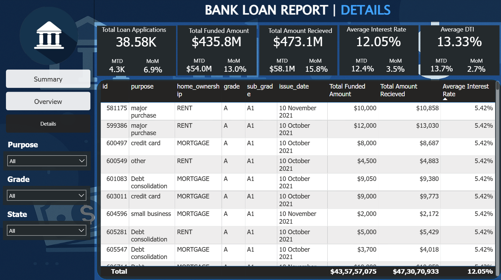

# 🏦 Bank Loan Analysis Dashboard (Power BI)

## 📌 Project Overview
This project is an **end-to-end Power BI dashboard** designed to analyze bank loan performance, customer behavior, and risk metrics.  
It provides insights into **loan applications, funded amounts, received amounts, interest rates, DTI, loan status**, and **customer segmentation** across multiple dimensions.

The dashboard helps stakeholders:
- Monitor overall loan performance
- Identify good vs bad loans
- Analyze trends over time

---

## 🎯 Business Objectives
- Track **Total Loan Applications, Funded Amount, and Amount Received**
- Compare **Good Loans vs Bad Loans**
- Analyze **Monthly trends (MoM, MTD)**
- Identify risk using **Interest Rate & Debt-to-Income (DTI)**
- Understand loan distribution by:
  - Purpose
  - Home ownership
  - Employment length
  - Loan term
  - Geography

---

## 📊 Dashboard Pages

### 1️⃣ Summary Page
High-level KPIs and performance indicators:
- Total Loan Applications
- Total Funded Amount
- Total Amount Received
- Total Interest Rate (Avg)
- Average DTI
- MTD & MoM comparisons


---

### 2️⃣ Overview Page
Visual analysis and trends:
- Loan applications by month
- Loan term distribution (36 vs 60 months)
- Loan applications by purpose
- Employment length analysis
- Home ownership breakdown
- Geographic distribution (Map)


---

### 3️⃣ Details Page
Record-level insights with drill-down capability:
- Individual loan details
- Funded vs received amounts
- Interest rates
- Loan grades and sub-grades
- Filterable table for deep analysis



---

## 🧮 Key Metrics & KPIs
- **Total Loan Applications**
- **Total Funded Amount**
- **Total Amount Received**
- **Average Interest Rate**
- **Average DTI**
- **Good Loan % vs Bad Loan %**
- **MTD & MoM Growth Metrics**

---

## 🛠️ Tools & Technologies Used
- **Power BI Desktop**
- **DAX (Data Analysis Expressions)**
- **Power Query (ETL)**
- **Data Modeling**
- **Interactive Visualizations**

---

## 🧠 DAX Concepts Used
- `CALCULATE`
- `COUNT`
- `SUM`
- `FILTER`
- Time Intelligence (MTD, MoM)
- Conditional Measures (Good vs Bad Loans)

---

## 📂 Project Structure
```text
├── Dashboard Screenshots
│   ├── Summary Page.png
│   ├── Overview Page.png
│   └── Details Page.png
├── DAX Measures
├── Power BI (.pbix) file
└── README.md
